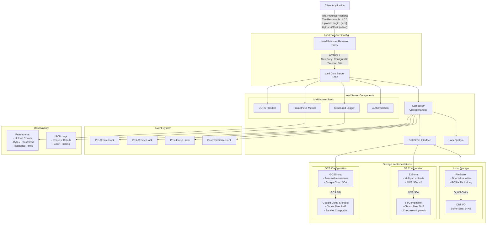
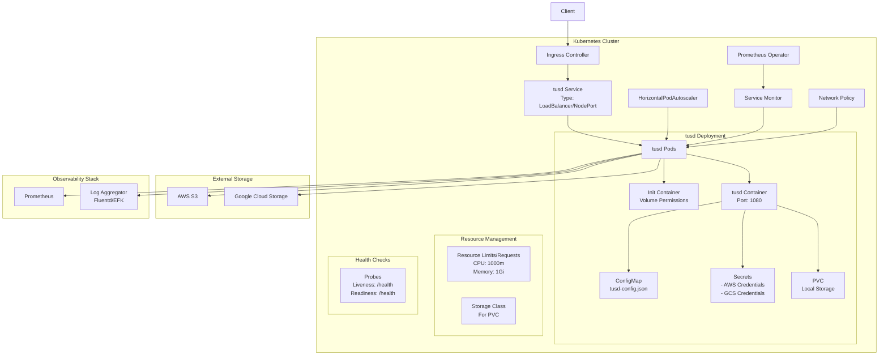

# tusd

> **tus** is a protocol based on HTTP for *resumable file uploads*. Resumable
> means that an upload can be interrupted at any moment and can be resumed without
> re-uploading the previous data again. An interruption may happen willingly, if
> the user wants to pause, or by accident in case of a network issue or server
> outage.

tusd is the official reference implementation of the [tus resumable upload
protocol](http://www.tus.io/protocols/resumable-upload.html). The protocol
specifies a flexible method to upload files to remote servers using HTTP.
The special feature is the ability to pause and resume uploads at any
moment allowing to continue seamlessly after e.g. network interruptions.

It is capable of accepting uploads with arbitrary sizes and storing them locally
on disk, on Google Cloud Storage or on AWS S3 (or any other S3-compatible
storage system). Due to its modularization and extensibility, support for
nearly any other cloud provider could easily be added to tusd.

**Protocol version:** 1.0.0

This branch contains tusd v2. If you are looking for the previous major release, after which
breaking changes have been introduced, please look at the [1.13.0 tag](https://github.com/tus/tusd/tree/v1.13.0).

## Documentation

The entire documentation, including guides on installing, using, and configuring tusd can be found on the website: [tus.github.io/tusd](https://tus.github.io/tusd).

## Build status

Below is an enhanced and more detailed version of the provided documentation, including improved formatting, additional context, and expanded explanations.

---

## Architecture

The diagram below provides a high-level overview of the deployment architecture for the TUS-based file upload service. It shows how requests flow from the client through the load balancer and into the `tusd` server, where middleware, hooks, and storage backends handle the entire upload lifecycle.

## Kubernetes Deployment Architecture

The following diagram illustrates how tusd is deployed in a Kubernetes cluster using Helm, showing the relationships between various Kubernetes resources and how they interact with external services.

---

### Overview

**Client → Load Balancer → tusd Server → Storage Backend**

The client application initiates file uploads by making TUS-compliant requests to a load balancer or reverse proxy. The proxy forwards the requests to a `tusd` instance, which manages the upload lifecycle. Using middleware for authentication, logging, metrics, and CORS, `tusd` communicates with various storage backends. This flexible design supports local file storage, as well as cloud-based solutions like Amazon S3 or Google Cloud Storage (GCS). Event hooks trigger custom logic at key points in the upload process, and observability components ensure robust monitoring and troubleshooting capabilities.

---

### Component Details

#### Client-Side Integration
**Key TUS Protocol Headers:**
- **`Tus-Resumable: 1.0.0`**: Indicates TUS protocol compliance.
- **`Upload-Length`**: Total size of the file being uploaded.
- **`Upload-Offset`**: Current byte offset of the upload.
- **`Upload-Metadata`**: Base64-encoded, key-value formatted metadata (e.g., file name, MIME type).

**Client Behavior:**
- Supports **HEAD** requests to retrieve current upload offset and verify upload status.
- Handles upload resumption by sending subsequent requests with the updated `Upload-Offset`.
- May set custom metadata for integration with downstream systems or business logic.

---

#### Load Balancer Configuration
**Reverse Proxy Requirements:**
- **Timeouts & Limits**: Configurable request timeout (e.g., 30s) and max body sizes.
- **SSL/TLS Termination**: Offload secure connections at the load balancer for simplified server config.
- **Chunked Transfer Encoding**: Proper handling for large, streaming uploads.
- **Health Checks**: Confirm `tusd` availability via a health endpoint (e.g., `/health`).
- **Scalability**: Ability to load-balance multiple `tusd` instances for horizontal scaling and high availability.

---

#### tusd Server Components

**Core Server (`:1080`):**
- Implements the TUS protocol (v1.0.0).
- Manages concurrent uploads efficiently.
- Validates requests and routes them to the appropriate handlers.
- Generates and maintains stable upload URLs.

**Composer/Upload Handler:**
- Coordinates the upload lifecycle (creation, partial updates, completion).
- Orchestrates chunked uploads and automatic offset tracking.
- Recovers partial uploads after interruption.
- Integrates with various storage backends through the `DataStore` interface.

**DataStore Interface:**
- Unified abstraction layer over storage backends.
- Ensures consistent read/write semantics regardless of storage type.
- Handles concurrency and transaction-like guarantees for atomic updates.
- Facilitates easy switching or mixing of storage providers.

**Lock System:**
- Ensures safe, concurrent access by multiple clients to the same upload resource.
- May be local (POSIX locks) or distributed (e.g., Redis-based) for multi-instance deployments.
- Includes deadlock prevention and automatic lock cleanup.

---

#### Middleware Stack

**CORS Handler:**
- Configurable allowed origins, headers, and methods.
- Handles pre-flight (`OPTIONS`) requests seamlessly.
- Ensures secure cross-domain operations.

**Prometheus Metrics:**
- Exposes operational metrics like upload success/failure counts, data throughput, and latency.
- Integrates with Prometheus-compatible monitoring tools and dashboards.
- Enables performance tuning and resource allocation based on observed patterns.

**Structured Logger:**
- Outputs logs in JSON or other structured formats.
- Provides traceable request IDs for correlation across services.
- Logs detailed request parameters, response statuses, and error messages.
- Facilitates auditing and compliance reporting.

**Authentication:**
- Supports various auth mechanisms (JWT, API keys, custom headers).
- Enables pre-signed URLs for secure, temporary access.
- Can integrate with existing identity providers or custom auth logic.

---

#### Storage Implementations

**FileStore (Local Storage):**
- Writes directly to disk with buffered I/O (64KB).
- Uses POSIX file locking for concurrency control.
- Organizes uploaded files in a configurable directory structure.
- Cleans up partially uploaded files on termination.

**S3Store (Amazon S3 or Compatible Services):**
- Uses AWS SDK v2 for robust S3 integration.
- Multipart uploads (5MB chunks) for improved reliability.
- Manages concurrent part uploads and automatic part finalization.
- Compatible with S3-like object stores (MinIO, Ceph RADOS Gateway).

**GCSStore (Google Cloud Storage):**
- Leverages GCS native resumable upload sessions.
- Employs 8MB chunks for optimal throughput.
- Supports parallel composite operations for large files.
- Capitalizes on Google’s global infrastructure for high availability and scalability.

---

#### Event System

**Pre-Create Hook:**
- Validates requests before creating new upload resources.
- Checks quotas, user permissions, and custom metadata policies.
- Can reject or modify requests to enforce business rules.

**Post-Create Hook:**
- Fires after a new upload is successfully initialized.
- Triggers notifications, database records, or external integrations.
- Prepares downstream systems for forthcoming data.

**Post-Finish Hook:**
- Executes upon successful upload completion.
- Ideal for post-processing tasks (e.g., virus scanning, thumbnail generation).
- Can update external systems, send webhooks, or finalize transactions.

**Post-Terminate Hook:**
- Handles cleanup logic when an upload is terminated prematurely.
- Notifies external systems, removes associated metadata, and logs the event.
- Ensures storage consistency and resource reclamation.

---

#### Observability

**Prometheus Integration:**
- Offers real-time metrics for dashboards and alerts.
- Metrics cover upload counts, bytes transferred, latency, and error rates.
- Enables proactive performance tuning and capacity planning.

**Structured Logging:**
- Provides rich, machine-parseable logs for troubleshooting.
- Captures request/response details, stack traces on errors, and latency data.
- Simplifies log aggregation, searching, and indexing (e.g., via ELK stack).

---

### Scaling and High Availability

**Horizontal Scaling:**
- Multiple `tusd` instances behind a load balancer support increased throughput.
- Distributed locking ensures data consistency across instances.

**Redundancy and Failover:**
- If one `tusd` instance fails, requests are routed to healthy instances.
- S3/GCS backends provide inherent data redundancy and durability.

---

### Security Considerations

- **TLS Termination** at the load balancer for secure data-in-transit.
- **Authentication/Authorization** middleware to restrict access.
- **Hooks for Validation** to implement custom security checks (file type, size limits, user entitlements).

---

### Kubernetes Resource Details

#### Core Resources
- **Deployment**
  - Replica count: 2-5 (configurable)
  - Update strategy: RollingUpdate
  - Pod anti-affinity for high availability
  - Resource limits and requests defined

- **Service**
  - Type: LoadBalancer or NodePort
  - Port: 1080 (configurable)
  - Session affinity: ClientIP

- **ConfigMap**
  - tusd configuration
  - Hook endpoints
  - Storage backend settings

- **Secrets**
  - AWS credentials
  - GCS service account
  - TLS certificates

#### Storage Configuration
- **PersistentVolumeClaim**
  - Size: 20Gi (configurable)
  - StorageClass: based on cloud provider
  - Access Mode: ReadWriteOnce

#### Monitoring & Scaling
- **HorizontalPodAutoscaler**
  - Min replicas: 2
  - Max replicas: 10
  - CPU target utilization: 80%
  - Memory target utilization: 80%

- **ServiceMonitor**
  - Endpoint: /metrics
  - Scrape interval: 30s
  - Prometheus integration

#### Network Security
- **NetworkPolicy**
  - Ingress rules for client traffic
  - Egress rules for storage backends
  - Inter-pod communication

#### Health Checks
- **Liveness Probe**
  - Path: /health
  - Initial delay: 30s
  - Period: 10s

- **Readiness Probe**
  - Path: /health
  - Initial delay: 5s
  - Period: 5s

#### Resource Management
- **CPU Limits**
  - Request: 500m
  - Limit: 1000m

- **Memory Limits**
  - Request: 512Mi
  - Limit: 1Gi

---

### License

This project is licensed under the MIT license. See `LICENSE.txt` for details.
